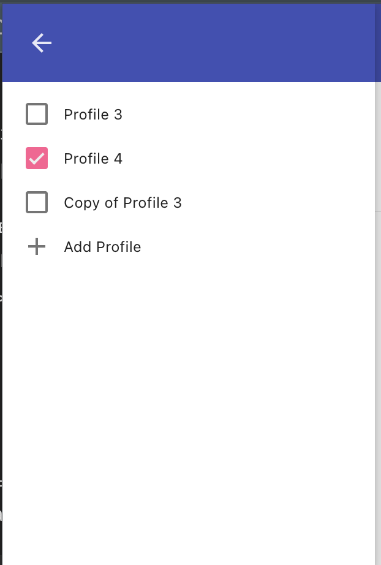

# ModHeader browser extension

ModHeader is a browser extension that allow you to modify HTTP request and response headers.

## Features

* Add/modify/remove request headers and response headers
* Enable header modification based on URL/resource type
* Add comments to header
* Multiple different profiles
* Sorting headers by name, value, or comments
* Append value to existing request or response header
* Export and import header
* Clone profile
* Cloud backup
* Tab locking!

## Screenshots

### Main page

### Profiles

### Setting

## Forking and contribution

Feel free to send pull requests to add new features to ModHeader. It will benefit everyone! That said, I reserve the rights to reject pull requests that does not seem useful, or if they add too much complexity for very little benefits.

You may fork and redistribute ModHeader for a small group of friends / colleagues, but please do not impersonate ModHeader, or try to sell it for a profit. If  you use ModHeader in any commercial product, please let me know.

## Installation

ModHeader does not require any extra tool for building. Simply load the src directory into Chrome / Firefox / YaBrowser to start local development.
